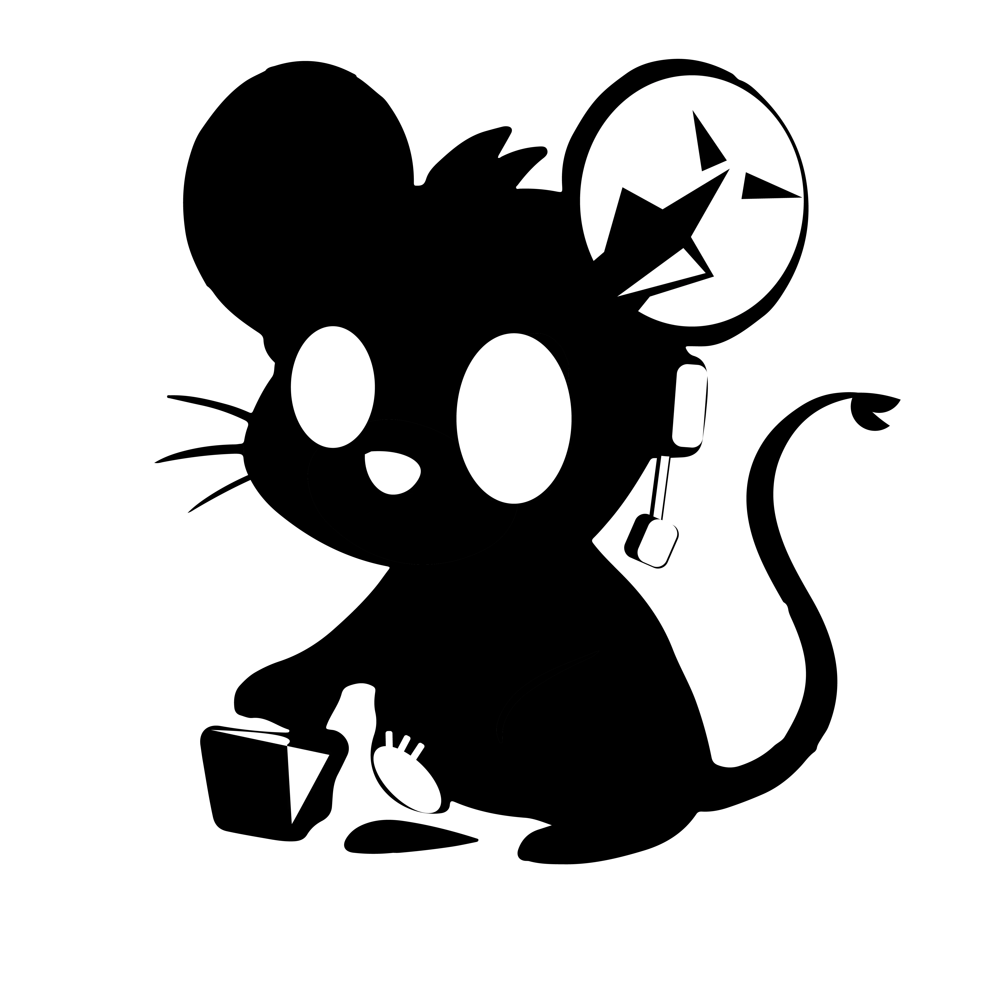

<h1 align="center"> Musi Musi — ADA / Soulheart </h1>

<p align="center">
  
</p>


<p align="center">
  <strong>IT Management Engineering student</strong><br>
  Focused on <strong>Cybersecurity</strong> & <strong>Information Protection</strong><br>
  Passionate about <code>Python</code>, <code>WebDev</code>, and <code>Modding Tools aka breaking my Favorite games in my free time</code>
</p>

---

###  Who am I?

Hallo I'm **ADA**, also known as **Soulheart** in some places.  
I spend my time building things and breaking things.  
I believe in learning by experience, late-night mental breakdown sessions, and giving everything a artsy touch.

---

###  What I Do

 Malware Analysis & VM Lab Work.  
 Web Development with Css and JavaScript.   
 Modding, bypassing and exploiting old consoles and hardware.
 Python scripting for automation.  
 Tinkering with data, networks, and my own machines.
 Digital paiting, WebToon storyboarder, music composer good old games enjoyner and  

---

### RatzAreCool

```txt
Languages:     Python, HTML, CSS, JavaScript, Bash, C++
WebDev:        Flask, Jinja2, Tailwind, Node.js
Cybersec:      VirtualBox, Wireshark, Burp Suite, custom scripts
Modding:       Hex editors, game engines, memory patching, Ren'Py, Godot and RPG MAKER
Tools:         Git, Archlinux, VS Code, VIM, CodeBlocks, Autodesk Maya,  Debloated Win10 and many many machines... FOSS everything
Extras:        Digital paiting, WebToon storyboarder, music composer, Rats Enjoyner and good old games user. 


